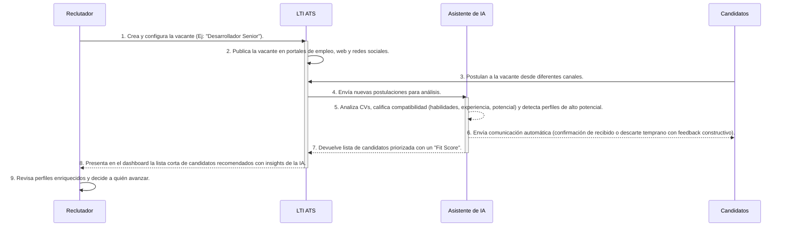
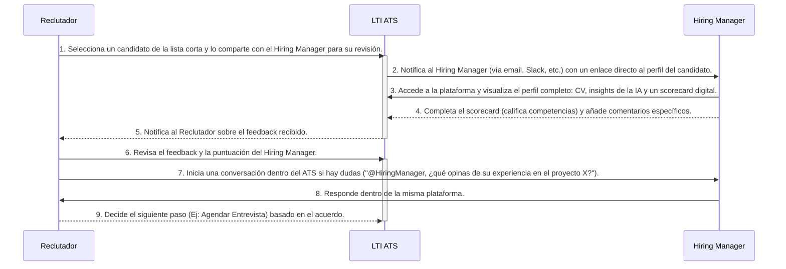
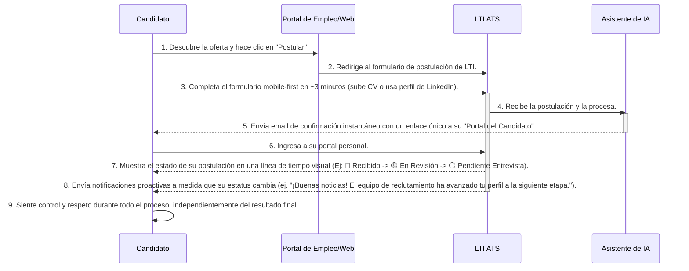
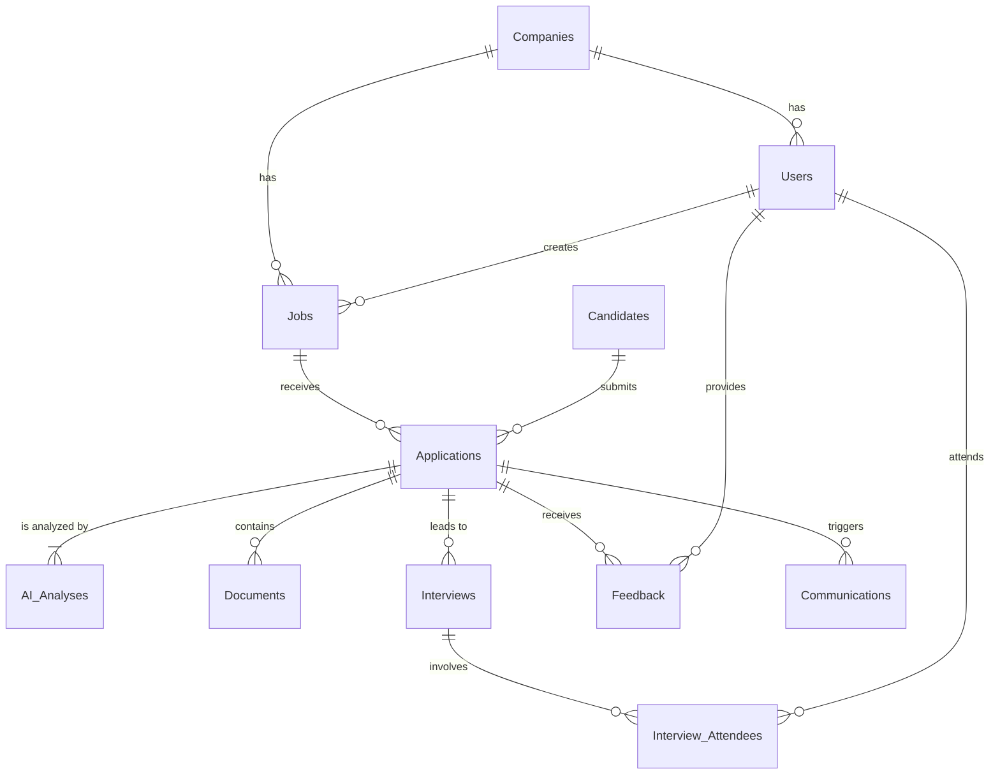
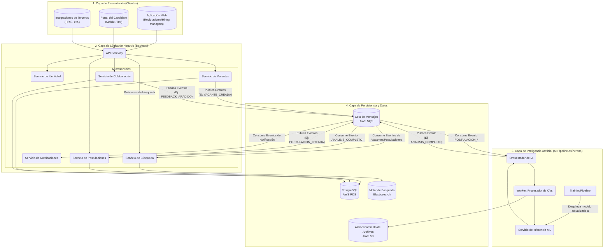
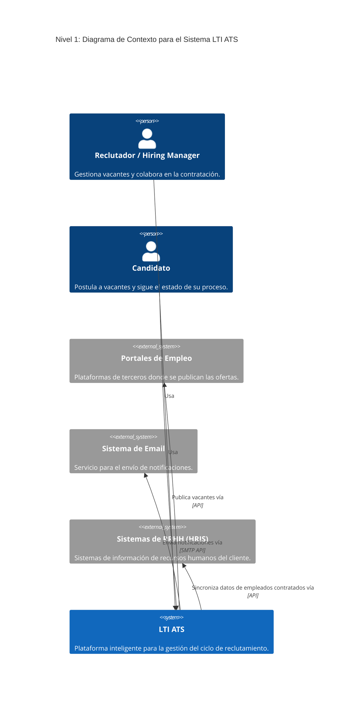
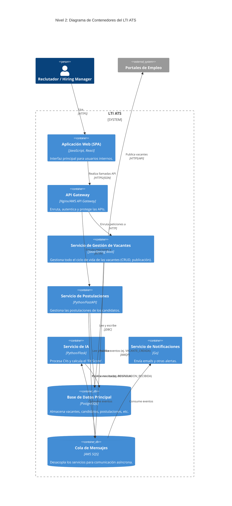
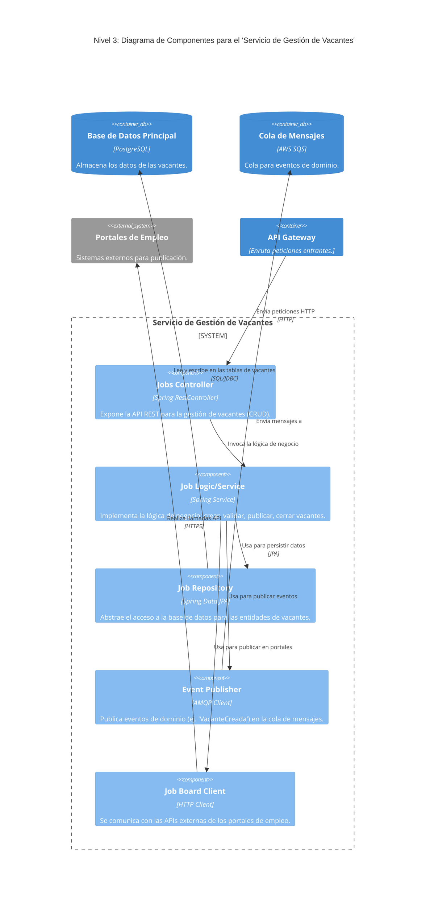

### **Lean Canvas: LTI - El ATS Inteligente**

A continuación, el desglose para un sistema de seguimiento de candidatos que no solo gestiona, sino que potencia y predice el éxito en la contratación, basado en un análisis de mercado para identificar oportunidades clave.

---

#### **1. Problemas Principales que Enfrenta el Cliente**

Los ATS actuales son vistos más como bases de datos que como herramientas estratégicas. Los problemas clave a resolver son:

* **Sobrecarga Operativa y Manual:** Los reclutadores invierten hasta un 70% de su tiempo en tareas repetitivas (revisión de CVs, agendamiento, comunicación básica) en lugar de en la interacción humana y evaluación estratégica.
* **Mala Calidad en la Selección (Sesgos y Acierto bajo):** La selección basada en palabras clave es superficial. Los sesgos inconscientes (de género, origen, etc.) se filtran en el proceso, y es difícil predecir qué candidato tendrá éxito real en el puesto.
* **Experiencia del Candidato Pésima ("El Agujero Negro"):** Los candidatos aplican y raramente reciben feedback. Los formularios son largos, no son *mobile-friendly* y el proceso es opaco, dañando la marca empleadora de la empresa.
* **Desconexión entre Reclutadores y Hiring Managers:** La colaboración es ineficiente, basada en emails y hojas de cálculo externas al ATS. No hay una fuente única de verdad para evaluar y comparar candidatos de forma objetiva.

---

#### **2. Segmentos de Clientes a los que se Dirige**

Para maximizar el impacto y la adopción inicial, nos enfocaremos en:

* **Early Adopters: Empresas de tecnología y startups en fase de crecimiento (Scale-ups)** de 50 a 500 empleados.
    * *¿Por qué?* Valoran la eficiencia, la tecnología, la calidad del talento y la marca empleadora. Están dispuestas a invertir en herramientas que les den una ventaja competitiva y están frustradas con la rigidez de los sistemas tradicionales.

* **Mercado Secundario: Departamentos de reclutamiento especializados dentro de grandes corporaciones** (ej. equipos de reclutamiento de perfiles tecnológicos o de alta demanda) y **agencias de reclutamiento modernas**.
    * *¿Por qué?* Buscan optimizar nichos de alta complejidad y valoran las herramientas que les permiten diferenciarse por la calidad y velocidad de su servicio.

---

#### **3. Propuesta de Valor Única**

> **"El primer ATS que utiliza inteligencia predictiva para identificar y contratar al mejor talento, mientras automatiza el 90% del trabajo operativo. Contrata más rápido, con mayor acierto y enamora a tus candidatos en el proceso."**

---

#### **4. Soluciones que Ofrece el Producto**

Más allá de las funcionalidades básicas (creación de empleos, publicación, etc., como se ve en la imagen), LTI ofrecerá una solución integral centrada en la inteligencia y la experiencia:

* **Asistente de IA para Reclutadores:** Un motor de IA que realiza el primer filtro de CVs, no por palabras clave, sino por compatibilidad de habilidades, experiencia y potencial de éxito. Además, gestiona la comunicación inicial y el agendamiento de forma automática.
* **Plataforma de Colaboración Unificada:** Un espacio central donde reclutadores y Hiring Managers pueden ver perfiles enriquecidos (con análisis de la IA), dejar feedback estructurado en *scorecards*, comunicarse en tiempo real y realizar entrevistas (con transcripción y análisis de sentimiento opcional).
* **Portal de Candidato Transparente y Gamificado:** Una experiencia de aplicación *mobile-first* que se completa en minutos. El candidato puede ver el estado de su postulación en tiempo real (como si rastreara un paquete), recibe comunicación proactiva y puede realizar pruebas gamificadas que son más atractivas que los tests tradicionales.
* **Analytics Predictivos y Accionables:** Un dashboard que no solo muestra métricas pasadas, sino que predice el *Time-to-Hire*, identifica los canales de sourcing más efectivos para cada rol y sugiere atributos clave de los candidatos que históricamente han tenido éxito en la empresa.

---

#### **5. Métricas Clave de Éxito**

Para medir el éxito, nos centraremos en métricas que reflejen la adopción, el valor entregado y la viabilidad del negocio:

* **Métricas de Valor:**
    * **Reducción del Tiempo de Contratación (Time-to-Hire):** Medida en días.
    * **Tasa de Aceptación de Ofertas (Offer Acceptance Rate):** Un indicador directo de la calidad del proceso y del candidato.
    * **Puntuación de Satisfacción del Candidato (CSAT / NPS del Candidato):** Demuestra la calidad de la experiencia.
* **Métricas de Negocio:**
    * **Ingresos Mensuales Recurrentes (MRR):** El pulso financiero del modelo SaaS.
    * **Coste de Adquisición de Cliente (CAC) y Valor de Vida del Cliente (LTV):** Para asegurar la rentabilidad.
    * **Tasa de Abandono (Churn Rate):** Para medir la retención y satisfacción del cliente.

---

#### **6. Ventaja Diferencial (Unfair Advantage)**

Nuestra ventaja competitiva, difícil de copiar, se basará en:

* **Algoritmo Predictivo Propio:** El modelo de Machine Learning que correlaciona los atributos de un candidato con el éxito a largo plazo en una empresa será nuestro activo más valioso. Se vuelve más inteligente con cada cliente, creando un foso competitivo (*data moat*).
* **API Robusta y Ecosistema de Integraciones:** Una API pensada para desarrolladores que permita integraciones profundas con cualquier otro sistema de HR (HRIS, Onboarding, etc.), convirtiendo a LTI en el cerebro central del ecosistema de talento.
* **Marca Centrada en la Experiencia:** Ser reconocidos como *el* ATS que por fin respeta el tiempo de los candidatos y potencia a los reclutadores. Esta reputación es un imán de talento y clientes.

---

#### **7. Canales de Adquisición y Comunicación**

Utilizaremos una estrategia multicanal para llegar a nuestros segmentos:

* **Marketing de Contenidos (Inbound):** Creación de blogs, whitepapers y webinars sobre el futuro del reclutamiento, IA en RRHH y cómo construir una marca empleadora fuerte. Optimización SEO para términos clave ("ATS inteligente", "software de reclutamiento con IA", etc.).
* **Venta Directa (Outbound):** Un equipo de ventas especializado que contactará a los Jefes de Talento y RRHH en nuestro segmento objetivo (scale-ups de tecnología).
* **Alianzas Estratégicas:** Partnerships con fondos de Venture Capital para ofrecer LTI a las empresas de su portafolio, e integraciones con plataformas de HRIS complementarias.
* **Comunidad y Eventos:** Participar y organizar eventos (online y presenciales) para profesionales de RRHH, creando una comunidad en torno a la innovación en la adquisición de talento.

---

#### **8. Fuentes de Ingresos Esperadas**

El modelo de negocio será principalmente **Software as a Service (SaaS)** con distintos niveles para adaptarse al crecimiento del cliente:

* **Plan Crecimiento (Growth):** Un paquete para empresas de hasta 150 empleados. Incluye todas las funcionalidades de automatización y colaboración. Precio por usuario (reclutador)/mes.
* **Plan Pro:** Para empresas de más de 150 empleados. Añade los módulos de analítica predictiva, tests gamificados avanzados e integraciones premium.
* **Plan Enterprise:** Para grandes corporaciones con necesidades personalizadas, soporte dedicado (*Dedicated Account Manager*), y SLAs (Acuerdos de Nivel de Servicio) específicos.
* **Add-ons:** Módulos opcionales de pago por uso, como la realización de video-entrevistas con análisis de IA o la compra de paquetes de multiposting en portales de empleo premium.

---

#### **9. Estructura de Costos**

Los costos principales se dividirán en tres áreas clave:

* **Desarrollo de Producto y Tecnología (El mayor coste):**
    * Salarios del equipo de ingeniería, data science, producto y diseño.
    * Costos de infraestructura en la nube (ej. AWS, Google Cloud) para el alojamiento, bases de datos y entrenamiento de modelos de IA.
    * Licencias de software y APIs de terceros.
* **Ventas y Marketing (Sales & Marketing):**
    * Salarios y comisiones del equipo de ventas y marketing.
    * Inversión en publicidad digital (LinkedIn, Google Ads).
    * Costos de creación de contenido y participación en eventos.
* **Operaciones y Administración (G&A):**
    * Salarios del equipo de soporte al cliente y administración.
    * Costos generales: oficinas (si aplica), servicios legales y contables.
    
    

-----

### **Casos de Uso Principales del ATS de LTI**

-----

### **Caso de Uso 1: El Reclutador Inteligente**

Este caso de uso se centra en cómo el reclutador utiliza la plataforma para automatizar las tareas operativas y centrarse en la estrategia, aprovechando la IA desde el primer momento.

  * **Título:** `Publicación de Vacante y Gestión Automatizada de Candidatos`
  * **Actores:** Reclutador, Asistente de IA (Sistema LTI), Candidatos (externos).
  * **Objetivo:** Publicar una nueva vacante y obtener una lista corta de los candidatos más calificados de forma automática, reduciendo el tiempo de revisión manual a casi cero.

<!-- end list -->

-----

### **Caso de Uso 2: Colaboración sin Fricción**

Este flujo detalla la interacción clave y a menudo rota entre el reclutador y el manager que necesita cubrir la vacante (Hiring Manager), eliminando la necesidad de emails y hojas de cálculo.

  * **Título:** `Evaluación Colaborativa entre Reclutador y Hiring Manager`
  * **Actores:** Reclutador, Hiring Manager.
  * **Objetivo:** Facilitar una toma de decisión rápida, objetiva y centralizada sobre un candidato, manteniendo toda la información y comunicación en un único lugar.

<!-- end list -->

-----

### **Caso de Uso 3: La Experiencia del Candidato**

Este es quizás el caso de uso más disruptivo, ya que cambia el paradigma de la postulación de ser un "agujero negro" a una experiencia transparente, respetuosa y moderna.

  * **Título:** `Postulación y Seguimiento Transparente del Proceso`
  * **Actores:** Candidato, Asistente de IA (Sistema LTI).
  * **Objetivo:** Ofrecer al candidato una experiencia de postulación simple, rápida y con visibilidad total sobre el estado de su proceso, fortaleciendo la marca empleadora.

<!-- end list -->

-----

### **Modelo de Datos para el ATS de LTI**

A continuación, se describen las entidades principales, sus atributos y las relaciones que las conectan.

#### **1. Entidades y Atributos**

Cada entidad representa una tabla en la base de datos. Se especifica el nombre del atributo, su tipo de dato y si es una clave primaria (PK) o foránea (FK).

-----

**Entidad: `Companies`**

  * Almacena la información de las empresas clientes que utilizan el ATS.
      * `company_id` (PK, UUID)
      * `name` (String)
      * `website` (String, Opcional)
      * `industry` (String, Opcional)
      * `logo_url` (String, Opcional)
      * `subscription_plan` (Enum: 'GROWTH', 'PRO', 'ENTERPRISE')
      * `created_at` (DateTime)

**Entidad: `Users`**

  * Representa a los usuarios dentro de una empresa cliente (Reclutadores, Hiring Managers).
      * `user_id` (PK, UUID)
      * `company_id` (FK, -\> Companies)
      * `email` (String, Unique)
      * `password_hash` (String)
      * `first_name` (String)
      * `last_name` (String)
      * `role` (Enum: 'RECRUITER', 'HIRING\_MANAGER', 'ADMIN')
      * `created_at` (DateTime)
      * `last_login_at` (DateTime)

**Entidad: `Candidates`**

  * Contiene la información personal y de contacto de cada persona que postula. Es una tabla centralizada para evitar duplicados.
      * `candidate_id` (PK, UUID)
      * `email` (String, Unique)
      * `first_name` (String)
      * `last_name` (String)
      * `phone_number` (String, Opcional)
      * `linkedin_profile_url` (String, Opcional)
      * `portfolio_url` (String, Opcional)
      * `created_at` (DateTime)

**Entidad: `Jobs`**

  * Define cada puesto de trabajo o vacante creada por una empresa.
      * `job_id` (PK, UUID)
      * `company_id` (FK, -\> Companies)
      * `created_by_user_id` (FK, -\> Users)
      * `title` (String)
      * `description` (Text)
      * `location` (String)
      * `status` (Enum: 'DRAFT', 'OPEN', 'CLOSED', 'ARCHIVED')
      * `created_at` (DateTime)
      * `closed_at` (DateTime, Opcional)

**Entidad: `Applications`**

  * Es la entidad de unión clave que conecta a un `Candidate` con un `Job`. Representa una postulación específica.
      * `application_id` (PK, UUID)
      * `job_id` (FK, -\> Jobs)
      * `candidate_id` (FK, -\> Candidates)
      * `status` (Enum: 'RECEIVED', 'AI\_REVIEW', 'HUMAN\_REVIEW', 'ASSESSMENT', 'INTERVIEW', 'OFFER', 'HIRED', 'REJECTED')
      * `source` (String) - *Ej: 'LinkedIn', 'Web Corporativa'*
      * `ai_fit_score` (Float, Opcional) - *Puntuación de 0 a 1 generada por la IA.*
      * `applied_at` (DateTime)
      * `updated_at` (DateTime)

**Entidad: `Documents`**

  * Almacena los archivos adjuntos a una postulación.
      * `document_id` (PK, UUID)
      * `application_id` (FK, -\> Applications)
      * `file_url` (String) - *URL a un servicio de almacenamiento como S3.*
      * `document_type` (Enum: 'CV', 'COVER\_LETTER', 'PORTFOLIO', 'OTHER')
      * `uploaded_at` (DateTime)

**Entidad: `AI_Analyses`**

  * Guarda los resultados estructurados del análisis de la IA para cada postulación.
      * `analysis_id` (PK, UUID)
      * `application_id` (FK, -\> Applications)
      * `extracted_skills` (JSON) - *Ej: `['Python', 'SQL', 'Project Management']`*
      * `summary` (Text) - *Resumen en lenguaje natural generado por la IA.*
      * `raw_output` (JSON) - *Respuesta completa del modelo de IA para depuración.*
      * `generated_at` (DateTime)

**Entidad: `Interviews`**

  * Registra cada entrevista agendada dentro del proceso.
      * `interview_id` (PK, UUID)
      * `application_id` (FK, -\> Applications)
      * `scheduled_by_user_id` (FK, -\> Users)
      * `start_time` (DateTime)
      * `end_time` (DateTime)
      * `location_or_video_link` (String)
      * `status` (Enum: 'SCHEDULED', 'COMPLETED', 'CANCELED')

**Entidad: `Interview_Attendees`**

  * Tabla de unión para gestionar los múltiples entrevistadores (`Users`) en una `Interview`.
      * `interview_id` (PK, FK, -\> Interviews)
      * `user_id` (PK, FK, -\> Users)

**Entidad: `Feedback`**

  * Centraliza todo el feedback (comentarios y calificaciones) de los `Users` sobre una `Application`.
      * `feedback_id` (PK, UUID)
      * `application_id` (FK, -\> Applications)
      * `user_id` (FK, -\> Users)
      * `content` (Text) - *Comentario cualitativo.*
      * `rating` (Integer, 1-5) - *Calificación general.*
      * `created_at` (DateTime)

**Entidad: `Communications`**

  * Registra toda la comunicación enviada a los candidatos, garantizando la trazabilidad.
      * `communication_id` (PK, UUID)
      * `application_id` (FK, -\> Applications)
      * `sender_info` (String) - *Ej: 'Asistente de IA' o 'Nombre del Reclutador'.*
      * `template_type` (Enum: 'CONFIRMATION', 'REJECTION', 'INTERVIEW\_INVITE', 'CUSTOM')
      * `body` (Text)
      * `sent_at` (DateTime)

-----

#### **2. Relaciones Clave del Modelo**

  * **Compañía y sus Usuarios/Vacantes:** Una `Company` tiene muchos `Users` y muchas `Jobs`. Esta es una relación **Uno a Muchos**.
  * **Postulación (El Corazón del Sistema):** La tabla `Applications` es el centro de todo.
      * Un `Job` puede tener muchas `Applications`.
      * Un `Candidate` puede tener muchas `Applications` (para diferentes vacantes).
      * Esta relación **Muchos a Muchos** entre `Jobs` y `Candidates` se resuelve a través de la tabla `Applications`.
  * **Datos de una Postulación:** Cada `Application` tiene una única `AI_Analysis` (o podría tener varias si se re-analiza), pero puede tener múltiples `Documents`, `Interviews`, `Feedback` y `Communications`. Todas estas son relaciones **Uno a Muchos** desde `Applications`.
  * **Colaboración en Entrevistas:** Una `Interview` puede tener varios `Interview_Attendees` (entrevistadores), modelado con una tabla de unión.
  * **Centralización del Candidato:** Al tener una tabla `Candidates` separada, se crea un perfil único para cada persona. Si el mismo candidato postula a 5 trabajos, solo existirá una entrada en `Candidates` y 5 en `Applications`, evitando la redundancia de datos personales.

-----

#### **3. Diagrama de Relaciones (Simplificado)**

Este modelo de datos proporciona una base sólida para desarrollar todas las funcionalidades descritas, desde la automatización con IA hasta una experiencia de usuario colaborativa y transparente. Está diseñado pensando en la escalabilidad y la separación de responsabilidades entre los distintos módulos del sistema.

-----

### **Diseño del Sistema a Alto Nivel: LTI ATS**

#### **Explicación de la Arquitectura**

El diseño se basa en una **arquitectura de microservicios distribuida y orientada a eventos**. Esta elección permite que cada componente del sistema (ej. gestión de vacantes, análisis de IA, notificaciones) se desarrolle, despliegue y escale de forma independiente. Esto reduce la complejidad y acelera la entrega de nuevas funcionalidades.

La plataforma será **nativa de la nube** (Cloud-Native), utilizando servicios gestionados de un proveedor como AWS (Amazon Web Services) para minimizar la carga operativa y maximizar la fiabilidad.

**Capas Principales:**

1.  **Capa de Presentación (Frontend):**

      * **Aplicación Web para Empresas (SPA):** Una *Single-Page Application* (construida con React, Vue o Angular) para reclutadores y *Hiring Managers*. Es la interfaz principal para gestionar vacantes, visualizar candidatos y colaborar. Se distribuye globalmente a través de una CDN (como AWS CloudFront) para una baja latencia.
      * **Portal del Candidato:** Una aplicación web ligera y 100% *responsive* (mobile-first), optimizada para que el proceso de postulación y seguimiento sea rápido y sencillo.
      * **Integraciones de Terceros (API Consumers):** Otros sistemas de RRHH (como HRIS o sistemas de nómina) que se conectan a nuestra plataforma a través de la API pública.

2.  **Capa de Lógica de Negocio (Backend):**

      * **API Gateway:** Es la única puerta de entrada para todas las peticiones de los clientes. Se encarga del enrutamiento de peticiones, la autenticación (validando tokens JWT), la seguridad y el *rate limiting*.
      * **Microservicios Principales:** Cada servicio tiene una responsabilidad única y se comunica con los demás a través de APIs REST/gRPC y eventos asíncronos.
          * **Servicio de Identidad:** Gestiona el registro, inicio de sesión y roles de los usuarios.
          * **Servicio de Vacantes y Compañías:** Lógica de negocio para crear, gestionar y publicar las ofertas de trabajo y los perfiles de empresa.
          * **Servicio de Postulaciones:** Orquesta el flujo de recepción de nuevas postulaciones.
          * **Servicio de Colaboración:** Gestiona el feedback, las entrevistas y los *scorecards*.
          * **Servicio de Notificaciones:** Envía todos los emails, SMS y notificaciones push de la plataforma de manera centralizada.

3.  **Capa de Inteligencia Artificial (AI Pipeline):**

      * Este es el corazón de la ventaja competitiva de LTI. Funciona de manera asíncrona para no bloquear la experiencia del usuario.
      * **Orquestador de IA:** Un servicio que se activa cuando se recibe una nueva postulación.
      * **Procesador de Documentos:** Un *worker* que extrae el texto de los CVs (PDF, DocX) y lo estructura.
      * **Servicio de Inferencia de ML:** Expone los modelos de Machine Learning (ej. extracción de habilidades, cálculo del *Fit Score*) a través de una API. Este servicio puede autoescalar según la demanda.
      * **Pipeline de Entrenamiento (Offline):** Un proceso separado que se ejecuta periódicamente para re-entrenar y mejorar los modelos de ML con los nuevos datos anonimizados, asegurando que la inteligencia del sistema evolucione.

4.  **Capa de Persistencia y Datos (Data Layer):**

      * **Base de Datos Principal (PostgreSQL - RDS):** Una base de datos relacional para almacenar los datos estructurados del modelo (Usuarios, Vacantes, Postulaciones, etc.). Se elige por su robustez y soporte para JSON.
      * **Almacenamiento de Documentos (AWS S3):** Un servicio de almacenamiento de objetos, ideal para guardar de forma segura y económica los CVs y otros archivos subidos por los candidatos.
      * **Cola de Mensajes (AWS SQS):** El sistema nervioso central de la arquitectura orientada a eventos. Desacopla los servicios. Por ejemplo, cuando se crea una postulación, el *Servicio de Postulaciones* publica un evento `POSTULACION_RECIBIDA` en la cola, y los servicios de *Notificaciones* y *Orquestador de IA* lo consumen para actuar en paralelo.
      * **Motor de Búsqueda y Analítica (Elasticsearch):** Para potenciar las búsquedas complejas de candidatos y alimentar los dashboards de analítica predictiva.

-----

#### **Diagrama del Sistema**

Este diagrama visualiza cómo interactúan los componentes descritos. Muestra el flujo de una petición desde que un usuario la inicia hasta que es procesada por el backend y la capa de IA.

-----

### **Modelo C4: Sistema LTI ATS**

El modelo C4 (Contexto, Contenedores, Componentes y Código) nos ayuda a contar la historia de una arquitectura de software. Nos detendremos en el Nivel 3 (Componentes), que es el más profundo necesario para un diseño de alto nivel.

-----

### **Nivel 1: Diagrama de Contexto del Sistema**

Este diagrama muestra una vista de "zoom máximo". Tratamos a todo el sistema LTI ATS como una caja negra y mostramos cómo interactúa con sus usuarios (actores) y con otros sistemas externos.

  * **Actores:**
      * **Reclutador/Hiring Manager:** El usuario principal que gestiona el ciclo de vida de las vacantes y los candidatos.
      * **Candidato:** La persona que postula a las vacantes y sigue su proceso.
  * **Sistemas Externos:**
      * **Portales de Empleo:** Sistemas externos donde se publican las vacantes (LinkedIn, Indeed, etc.).
      * **Sistema de Email:** Servicio externo para enviar notificaciones.
      * **Sistemas de RRHH (HRIS):** Sistemas corporativos con los que LTI podría sincronizarse.

<!-- end list -->

-----

### **Nivel 2: Diagrama de Contenedores**

Ahora hacemos "zoom" dentro de la caja del "LTI ATS" para ver sus principales bloques de construcción. Un "contenedor" es una unidad desplegable, como una aplicación web, un microservicio o una base de datos.

  * **Contenedores Clave:**
      * **Aplicación Web (SPA):** La interfaz para Reclutadores y Hiring Managers.
      * **API Gateway:** Punto de entrada único que enruta las peticiones.
      * **Servicio de Gestión de Vacantes:** El microservicio que nos interesa.
      * **Servicio de Postulaciones:** Gestiona las aplicaciones de los candidatos.
      * **Servicio de IA:** Realiza el análisis de los CVs.
      * **Base de Datos Principal:** Almacena los datos estructurados.
      * **Cola de Mensajes:** Para la comunicación asíncrona entre servicios.

<!-- end list -->

-----

### **Nivel 3: Diagrama de Componentes (Enfoque: Gestión de Vacantes)**

Finalmente, hacemos "zoom" dentro del contenedor **"Servicio de Gestión de Vacantes"**. Mostramos sus componentes lógicos internos (no son microservicios separados, sino módulos principales dentro de ese servicio).

  * **Componentes Internos:**
      * **Jobs Controller:** El punto de entrada de las peticiones HTTP.
      * **Job Logic/Service:** Contiene la lógica de negocio principal.
      * **Job Repository:** Encapsula el acceso a la base de datos.
      * **Event Publisher:** Encapsula la publicación de mensajes en la cola.
      * **Job Board Client:** Encapsula la comunicación con las APIs de los portales de empleo.

<!-- end list -->

